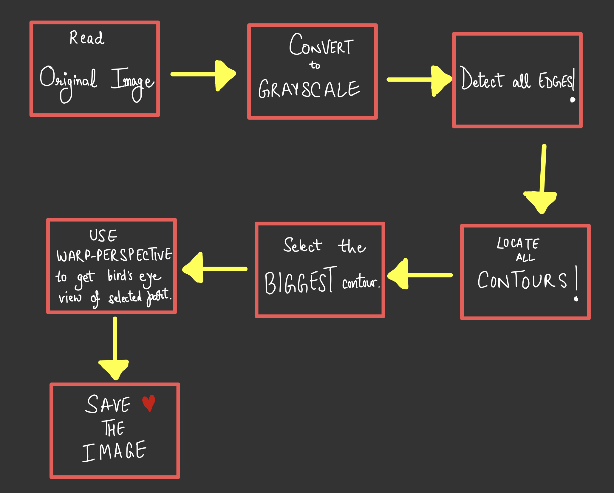
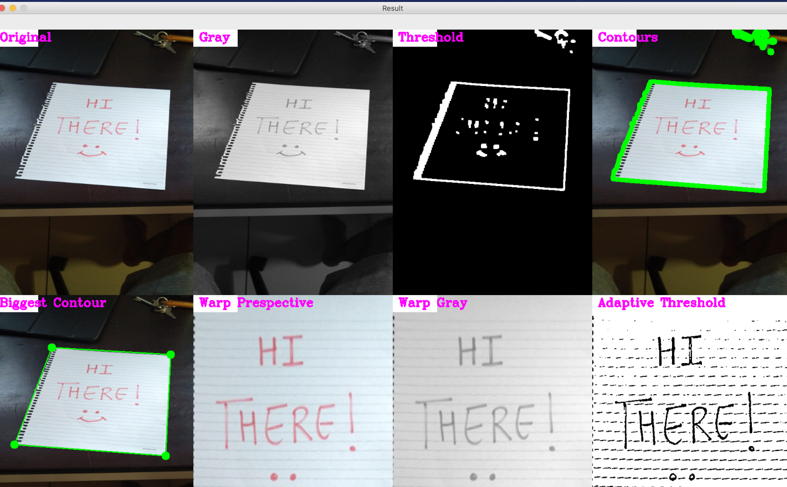

# DocScanner
This project entails a built-from-scratch document scanner using [OpenCV](https://opencv-python-tutroals.readthedocs.io/en/latest/) and [NumPy](https://numpy.org). It can take the user's custom image input as well as has the option of capturing the image through the webcam.

# PipeLine


# Visual Outcomes for Display
### When it WORKS!


# Set-up/ How to use
Must have Python3.4+ installed in your machine.
First, create a virtual enviornment in your local drive.
```
 python3 -m venv docscanner
```
Then, download all the dependencies by running the following code in your terminal
```
pip3 install -r requirements.txt

```
Then run the following command to run the main code
```
python3 main.py -img \path\to\your\image
```
A window similar to the one in 'Visual Outcomes for Display' opens up. Press 'q' to save the image. The image is saved in the 'Scanned' folder.
# Known Issues
- Webcam capture does not working efficiently as of now. Contour detection fails most of the time. Low resolution from the webcam also does not help.

# References
[OpenCV-Python Tutorial's documentation](https://opencv-python-tutroals.readthedocs.io/en/latest/)
Youtube Channel - [Murtaza's Workshop](https://www.youtube.com/watch?v=ON_JubFRw8M&t=512s)


## License

[](http://badges.mit-license.org)

- **[MIT license](http://opensource.org/licenses/mit-license.php)**
